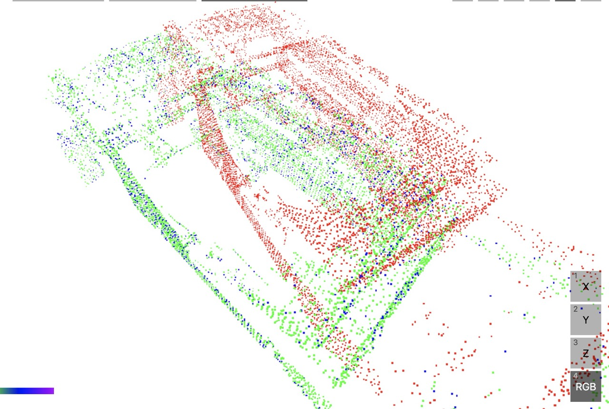
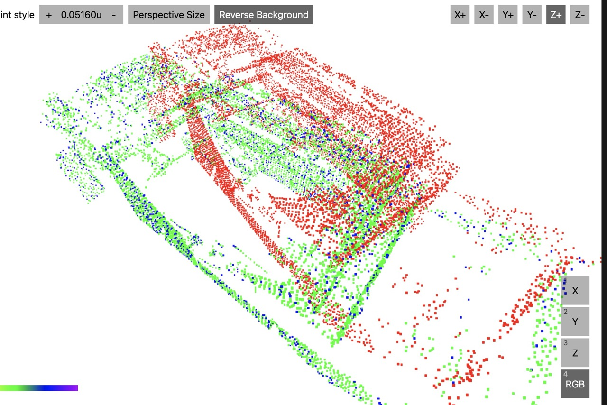

```bash
    Finished `release` profile [optimized] target(s) in 0.04s
     Running `target/release/icp-practice`
Loaded 8648 points from data/input/clipped_Laser_map_5_voxel-01.pcd
Loaded 8648 points from data/input/clipped_rotated_Laser_map_5_voxel-01.pcd
Iteration 1: mean error = 1.0439916464907397
Iteration 2: mean error = 0.601891628480264
Iteration 3: mean error = 0.38416030034441384
Iteration 4: mean error = 0.27603382225850187
Iteration 5: mean error = 0.2157811017377313
Iteration 6: mean error = 0.1726660844672342
Iteration 7: mean error = 0.14088997752415158
Iteration 8: mean error = 0.11377498474754932
Iteration 9: mean error = 0.09457067056132626
Iteration 10: mean error = 0.07812214785789923
Iteration 11: mean error = 0.06411156241602597
Iteration 12: mean error = 0.05316822317234954
Iteration 13: mean error = 0.03608341319236813
Iteration 14: mean error = 0.0044586581065028654
Iteration 15: mean error = 0.0000013663679639036932
Converged at iteration 15
ICP completed in 38.49s
Final aligned source points:
[[-1.3830013306137687, -2.763094705085671, 2.889031986068966],
 [2.7929324260082566, -0.15770319768268062, 3.1194660523612354],
 [-0.8313907430372666, -2.8195444745720812, 3.252139908482416],
 [2.823343927250143, 0.6265968370780625, 3.127711173212221],
 [-1.3558054797988892, -2.1895806220796383, 2.763139006885925],
 ...,
 [0.2078263023261609, -3.6597065857382995, 2.2933606679577094],
 [0.7728007425239349, -3.689777592698387, 2.2245149450333535],
 [1.3892270286627473, -6.135237592828931, 2.545611509448216],
 [2.488079354942265, 3.6424423237915056, 3.0690105201133195],
 [2.1358247998700244, -2.960904059817216, 2.123690228284867]], shape=[8648, 3], strides=[3, 1], layout=Cc (0x5), const ndim=2
Saved aligned points to data/output/icp_aligned_result.pcd
```


```bash
sudo apt update
sudo apt install -y build-essential gfortran pkg-config \
  libopenblas-dev liblapacke-dev \
  libfreetype6-dev libfontconfig1-dev

```

```bash
    Finished `release` profile [optimized] target(s) in 13.34s
     Running `target/release/icp-practice`
Loaded 8648 points from data/input/clipped_Laser_map_5_voxel-01.pcd
Loaded 8648 points from data/input/clipped_rotated_Laser_map_5_voxel-01.pcd
Iteration 1: mean error (from 1000 samples) = 1.0464834623582155
Iteration 2: mean error (from 1000 samples) = 0.609215262737433
Iteration 3: mean error (from 1000 samples) = 0.3816289746406624
Iteration 4: mean error (from 1000 samples) = 0.27243088716564345
Iteration 5: mean error (from 1000 samples) = 0.2152007702925228
Iteration 6: mean error (from 1000 samples) = 0.16099589469484907
Iteration 7: mean error (from 1000 samples) = 0.13743164150654025
Iteration 8: mean error (from 1000 samples) = 0.10981857895711765
Iteration 9: mean error (from 1000 samples) = 0.09191812939351476
Iteration 10: mean error (from 1000 samples) = 0.07818369801694519
Iteration 11: mean error (from 1000 samples) = 0.06053797777929556
Iteration 12: mean error (from 1000 samples) = 0.05150612374520945
Iteration 13: mean error (from 1000 samples) = 0.029858870901635654
Iteration 14: mean error (from 1000 samples) = 0.002605250767303638
Iteration 15: mean error (from 1000 samples) = 0.000001373912088804934
Converged at iteration 15
ICP completed in 4.95s
Final aligned source points:
[[-1.3830013419269138, -2.7630947251344193, 2.8890319682524694],
 [2.7929324213327864, -0.15770322971726616, 3.119466049773871],
 [-0.8313907561885355, -2.8195444956943514, 3.252139893291388],
 [2.8233439248541448, 0.6265968049662518, 3.1277111695631215],
 [-1.355805488837968, -2.189580642401637, 2.763138988315861],
 ...,
 [0.20782629110551387, -3.6597066114002685, 2.2933606588373374],
 [0.7728007315313211, -3.689777620135212, 2.224514938559541],
 [1.3892270089664116, -6.135237621595166, 2.5456115095586807],
 [2.4880793617275776, 3.642442292580384, 3.069010510300134],
 [2.1358247914951427, -2.960904091435943, 2.1236902269680455]], shape=[8648, 3], strides=[3, 1], layout=Cc (0x5), const ndim=2
Saved aligned points to data/output/icp_aligned_result.pcd
```


```bash
    Finished `release` profile [optimized] target(s) in 0.04s
     Running `target/release/icp-practice`
Loaded 8648 points from data/input/clipped_Laser_map_5_voxel-01.pcd
Loaded 8648 points from data/input/clipped_rotated_Laser_map_5_voxel-01.pcd
Building k-d tree for target points...
k-d tree built with 8648 points.
Iteration 1: mean error (from 1000 samples) = 1.0446385821383755
Iteration 2: mean error (from 1000 samples) = 0.5873034016102705
Iteration 3: mean error (from 1000 samples) = 0.36403091183861064
Iteration 4: mean error (from 1000 samples) = 0.2583300085675888
Iteration 5: mean error (from 1000 samples) = 0.21627686163731766
Iteration 6: mean error (from 1000 samples) = 0.1742183760260833
Iteration 7: mean error (from 1000 samples) = 0.14545670188513146
Iteration 8: mean error (from 1000 samples) = 0.11534543682769269
Iteration 9: mean error (from 1000 samples) = 0.09671960468391964
Iteration 10: mean error (from 1000 samples) = 0.08161164571947765
Iteration 11: mean error (from 1000 samples) = 0.06551348527391969
Iteration 12: mean error (from 1000 samples) = 0.05514149429704223
Iteration 13: mean error (from 1000 samples) = 0.043630409860132884
Iteration 14: mean error (from 1000 samples) = 0.011804347751780154
Iteration 15: mean error (from 1000 samples) = 0.0000013772899130808636
Converged at iteration 15
ICP completed in 14.75ms
Final aligned source points:
[[-1.383001357550102, -2.763094680792489, 2.889032009404853],
 [2.7929324064181085, -0.1577031830264733, 3.1194660515293187],
 [-0.8313907686045491, -2.819544450679675, 3.252139929676222],
 [2.8233439096176536, 0.6265968516813059, 3.127711170197749],
 [-1.355805505851389, -2.189580598183221, 2.763139028605254],
 ...,
 [0.20782627071795437, -3.6597065669082376, 2.293360687039827],
 [0.7728007105561604, -3.689777575434382, 2.224514961848746],
 [1.38922699203076, -6.135237576234803, 2.5456115301159983],
 [2.488079344462183, 3.6424423390630594, 3.069010510583731],
 [2.1358247692711645, -2.9609040461602563, 2.1236902375305133]], shape=[8648, 3], strides=[3, 1], layout=Cc (0x5), const ndim=2
Saved aligned points to data/output/icp_aligned_result.pcd
```


```bash
    Finished `release` profile [optimized] target(s) in 0.04s
     Running `target/release/icp-practice`
Loaded 8648 points from data/input/clipped_Laser_map_5_voxel-01.pcd
Loaded 8648 points from data/input/clipped_rotated_Laser_map_5_voxel-01.pcd
Building k-d tree for target points...
k-d tree built with 8648 points.
Iteration 1: mean error (from 900 inliers, 90% kept) = 0.9458750314254616
Iteration 2: mean error (from 900 inliers, 90% kept) = 0.6584152639788842
Iteration 3: mean error (from 900 inliers, 90% kept) = 0.4634720807325152
Iteration 4: mean error (from 900 inliers, 90% kept) = 0.3374667019383421
Iteration 5: mean error (from 900 inliers, 90% kept) = 0.2939757678382157
Iteration 6: mean error (from 900 inliers, 90% kept) = 0.26204339912311175
Iteration 7: mean error (from 900 inliers, 90% kept) = 0.23390465278708986
Iteration 8: mean error (from 900 inliers, 90% kept) = 0.21064352898216868
Iteration 9: mean error (from 900 inliers, 90% kept) = 0.19842286573693826
Iteration 10: mean error (from 900 inliers, 90% kept) = 0.1633831389161761
Iteration 11: mean error (from 900 inliers, 90% kept) = 0.1588250992095359
Iteration 12: mean error (from 900 inliers, 90% kept) = 0.1336266136929849
Iteration 13: mean error (from 900 inliers, 90% kept) = 0.11227691131783925
Iteration 14: mean error (from 900 inliers, 90% kept) = 0.10114049339247433
Iteration 15: mean error (from 900 inliers, 90% kept) = 0.08887424197198146
Iteration 16: mean error (from 900 inliers, 90% kept) = 0.07511227285962939
Iteration 17: mean error (from 900 inliers, 90% kept) = 0.06223458554024329
Iteration 18: mean error (from 900 inliers, 90% kept) = 0.05459354573724842
Iteration 19: mean error (from 900 inliers, 90% kept) = 0.048081930463290554
Iteration 20: mean error (from 900 inliers, 90% kept) = 0.02624433296908948
ICP completed in 22.88ms
Final aligned source points:
[[-1.3796347432860474, -2.7623484278390014, 2.8973596763409257],
 [2.8083630672948035, -0.1748409204543038, 3.109648967754144],
 [-0.8264630018136556, -2.821509560719727, 3.257650066045735],
 [2.8421275029770277, 0.6093146692066309, 3.118557392862286],
 [-1.350645276474148, -2.1888209742409437, 2.771928696520685],
 ...,
 [0.20440062654693802, -3.665030547627672, 2.2928212745788885],
 [0.7688925604063971, -3.6974114390027637, 2.2211243319472698],
 [1.3765791736440232, -6.145789056744237, 2.5365969982668486],
 [2.5193145452770196, 3.6266080996646735, 3.0646663109972954],
 [2.1344629038758223, -2.9741873970568427, 2.1142531312686836]], shape=[8648, 3], strides=[3, 1], layout=Cc (0x5), const ndim=2
Saved aligned points to data/output/icp_aligned_result.pcd
```

```bash
Iteration 91: mean error (from 900 inliers, 90% kept) = 0.22696757218747737
Iteration 92: mean error (from 900 inliers, 90% kept) = 0.2218429011222714
Iteration 93: mean error (from 900 inliers, 90% kept) = 0.22484921711870376
Iteration 94: mean error (from 900 inliers, 90% kept) = 0.22764336597419935
Iteration 95: mean error (from 900 inliers, 90% kept) = 0.23431293657691019
Iteration 96: mean error (from 900 inliers, 90% kept) = 0.21847900487889513
Iteration 97: mean error (from 900 inliers, 90% kept) = 0.22723875194736204
Iteration 98: mean error (from 900 inliers, 90% kept) = 0.22154349377226173
Iteration 99: mean error (from 900 inliers, 90% kept) = 0.2320046739053695
Iteration 100: mean error (from 900 inliers, 90% kept) = 0.22549719745109068
ICP completed in 113.56ms
Final aligned source points:
[[3.088410472841851, 2.4478182450361854, 2.8648332524395848],
 [-1.0929312639133815, -0.15840753124603799, 2.8051711660063816],
 [2.5158509786282393, 2.499347640293998, 3.1947254651528603],
 [-1.1235185941260606, -0.9427286316859056, 2.800314660962009],
 [3.0690656844958517, 1.876182379771304, 2.729315952449099],
 ...,
 [1.5361729639363797, 3.3537157497487953, 2.1870619008845367],
 [0.9763796443735486, 3.385068513672814, 2.084647303042251],
 [0.3408498281387223, 5.825999005825075, 2.4029557635111836],
 [-0.784295976559442, -3.9575987078808477, 2.7187292244822583],
 [-0.37781513152753654, 2.6584340994198574, 1.8912176112855406]], shape=[8648, 3], strides=[3, 1], layout=Cc (0x5), const ndim=2
Saved aligned points to data/output/icp_aligned_result.pcd
```

# Rayoon ver
```bash
Iteration 93: mean error (from 900 inliers, 90% kept) = 0.2386551552865362
Iteration 94: mean error (from 900 inliers, 90% kept) = 0.21717580926292435
Iteration 95: mean error (from 900 inliers, 90% kept) = 0.2347494929801366
Iteration 96: mean error (from 900 inliers, 90% kept) = 0.22673543009123265
Iteration 97: mean error (from 900 inliers, 90% kept) = 0.23481926216221916
Iteration 98: mean error (from 900 inliers, 90% kept) = 0.23099947776692673
Iteration 99: mean error (from 900 inliers, 90% kept) = 0.23574011854062193
Iteration 100: mean error (from 900 inliers, 90% kept) = 0.23322564705416554
ICP completed in 81.10ms
Final aligned source points:
[[3.0921511086225495, 2.479823469281637, 2.8577839861186725],
 [-1.0953162098288547, -0.1167376293959099, 2.807000142405136],
 [2.521005150274374, 2.531697068111079, 3.1900639117922784],
 [-1.127708323879522, -0.9009701072379177, 2.8000050976520514],
 [3.070974699630739, 1.908626714962263, 2.720698066173516],
 ...,
 [1.5393414559376728, 3.39118984573314, 2.1887106803526537],
 [0.9792246883974631, 3.4241066837614236, 2.0885807908162564],
 [0.35050502790157106, 5.86554142503476, 2.416404041147576],
 [-0.7956739278151125, -3.9163528860126036, 2.708410330611442],
 [-0.37736752380790656, 2.701104425487089, 1.898366666678343]], shape=[8648, 3], strides=[3, 1], layout=Cc (0x5), const ndim=2
Saved aligned points to data/output/icp_aligned_result.pcd
```

```bash
Iteration 19: mean error (from 900 inliers, 90% kept) = 0.10797399346256444
Iteration 20: mean error (from 900 inliers, 90% kept) = 0.08986213743873002
Iteration 21: mean error (from 900 inliers, 90% kept) = 0.07984539537995657
Iteration 22: mean error (from 900 inliers, 90% kept) = 0.0721528124112976
Iteration 23: mean error (from 900 inliers, 90% kept) = 0.06403284700714232
Iteration 24: mean error (from 900 inliers, 90% kept) = 0.05414682812267965
Iteration 25: mean error (from 900 inliers, 90% kept) = 0.049831343529603
Iteration 26: mean error (from 900 inliers, 90% kept) = 0.048239938466597514
Iteration 27: mean error (from 900 inliers, 90% kept) = 0.04273071407582903
Iteration 28: mean error (from 900 inliers, 90% kept) = 0.019889086822403736
Iteration 29: mean error (from 900 inliers, 90% kept) = 0.0001268325895747897
Converged at iteration 29
ICP completed in 26.93ms
Final aligned source points:
[[-1.3830098412326473, -2.7631222623353384, 2.8890439912941996],
 [2.7929439767666753, -0.15776278145665318, 3.1194529886082654],
 [-0.8313985491127668, -2.8195746815120732, 3.252150265159922],
 [2.8233609521060976, 0.6265369475214699, 3.127694831960442],
 [-1.3558095189063126, -2.1896085033394748, 2.7631488009288807],
 ...,
 [0.20780811674304087, -3.659750158748698, 2.2933705591175295],
 [0.7727815951475338, -3.6898263065388144, 2.2245229914355127],
 [1.3891887420152964, -6.135290767330523, 2.5456267644792776],
 [2.4881205159205564, 3.6423860244437267, 3.0689836888016],
 [2.135810199448069, -2.9609642597042605, 2.1236903748228038]], shape=[8648, 3], strides=[3, 1], layout=Cc (0x5), const ndim=2
Saved aligned points to data/output/icp_aligned_result.pcd
```
# kdtree-without-noise
```bash
Iteration 25: mean error (from 900 inliers, 90% kept) = 0.05230182770125113
Iteration 26: mean error (from 900 inliers, 90% kept) = 0.046078195462805865
Iteration 27: mean error (from 900 inliers, 90% kept) = 0.03452975409719776
Iteration 28: mean error (from 900 inliers, 90% kept) = 0.004458859043552735
Converged at iteration 28
ICP completed in 34.57ms
Final aligned source points:
[[-1.383938403518573, -2.7641153522093287, 2.889353453391232],
 [2.793040440912232, -0.16034579220284986, 3.1191543068970224],
 [-0.832310871368969, -2.8207558764959195, 3.252405758340256],
 [2.8237596878542557, 0.6239427295796589, 3.1273413523539846],
 [-1.3565308458518168, -2.1906203707585177, 2.7634176749848747],
 ...,
 [0.20647254375332416, -3.661393733218241, 2.2935726853083382],
 [0.7714272178054976, -3.691691534238044, 2.2246680188331043],
 [1.386928092018497, -6.137371583125223, 2.545868275816267],
 [2.4896721496623284, 3.6399165532535807, 3.0684667831735117],
 [2.1347252743485208, -2.9633600058228873, 2.123644903791443]], shape=[8648, 3], strides=[3, 1], layout=Cc (0x5), const ndim=2
Saved aligned points to data/output/icp_aligned_result.pcd
```