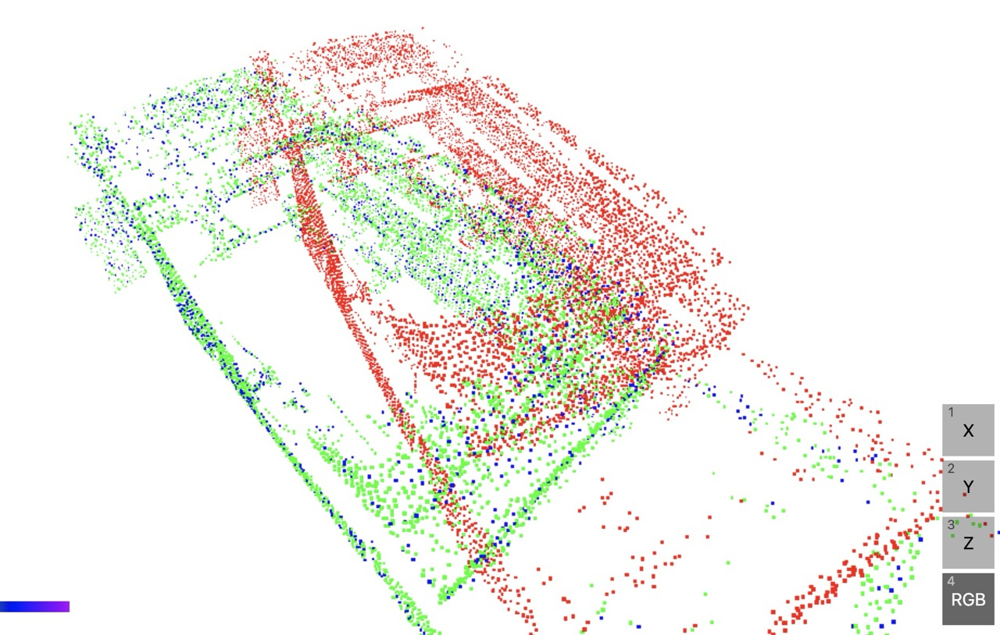

```bash
    Finished `release` profile [optimized] target(s) in 0.04s
     Running `target/release/icp-practice`
Loaded 8648 points from data/input/clipped_Laser_map_5_voxel-01.pcd
Loaded 8648 points from data/input/clipped_rotated_Laser_map_5_voxel-01.pcd
Iteration 1: mean error = 1.0439916464907397
Iteration 2: mean error = 0.601891628480264
Iteration 3: mean error = 0.38416030034441384
Iteration 4: mean error = 0.27603382225850187
Iteration 5: mean error = 0.2157811017377313
Iteration 6: mean error = 0.1726660844672342
Iteration 7: mean error = 0.14088997752415158
Iteration 8: mean error = 0.11377498474754932
Iteration 9: mean error = 0.09457067056132626
Iteration 10: mean error = 0.07812214785789923
Iteration 11: mean error = 0.06411156241602597
Iteration 12: mean error = 0.05316822317234954
Iteration 13: mean error = 0.03608341319236813
Iteration 14: mean error = 0.0044586581065028654
Iteration 15: mean error = 0.0000013663679639036932
Converged at iteration 15
ICP completed in 38.49s
Final aligned source points:
[[-1.3830013306137687, -2.763094705085671, 2.889031986068966],
 [2.7929324260082566, -0.15770319768268062, 3.1194660523612354],
 [-0.8313907430372666, -2.8195444745720812, 3.252139908482416],
 [2.823343927250143, 0.6265968370780625, 3.127711173212221],
 [-1.3558054797988892, -2.1895806220796383, 2.763139006885925],
 ...,
 [0.2078263023261609, -3.6597065857382995, 2.2933606679577094],
 [0.7728007425239349, -3.689777592698387, 2.2245149450333535],
 [1.3892270286627473, -6.135237592828931, 2.545611509448216],
 [2.488079354942265, 3.6424423237915056, 3.0690105201133195],
 [2.1358247998700244, -2.960904059817216, 2.123690228284867]], shape=[8648, 3], strides=[3, 1], layout=Cc (0x5), const ndim=2
Saved aligned points to data/output/icp_aligned_result.pcd
```
